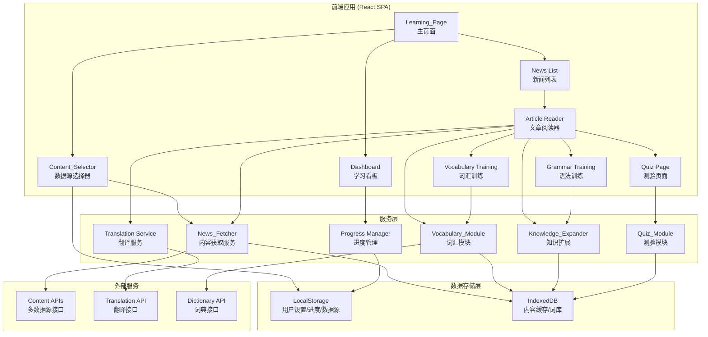

# Design Document: English Learning News

## Overview

本系统是一个面向中文母语用户的英语学习网页应用，核心理念是通过多种内容来源提供沉浸式英语学习体验。系统支持五种数据源切换：时政新闻（current-affairs）、高中英语（senior-high）、初中英语（junior-high）、初中高中混合（junior-senior-mixed）、小学英语（elementary），用户可根据自身英语水平和兴趣自由选择学习素材。系统整合内容获取与数据源切换、翻译辅助、词汇学习、语法训练、趣味测验和知识扩展等功能模块，在真实语境中帮助不同水平的学习者提升英语综合能力。

### 技术选型

- **前端**: React + TypeScript (SPA 单页应用)
- **样式**: Tailwind CSS (现代化设计、响应式布局)
- **状态管理**: Zustand (轻量级状态管理)
- **数据持久化**: LocalStorage + IndexedDB (离线缓存)
- **内容API**: 外部新闻 API (如 NewsAPI, GNews) + 教育内容 API + 内容过滤与数据源切换
- **翻译服务**: 集成翻译 API (如 Google Translate API / DeepL)
- **测试框架**: Vitest + fast-check (属性测试)

### 设计决策

1. **客户端为主架构**: 减少后端依赖，使用浏览器存储用户进度数据，降低部署复杂度
2. **模块化设计**: 各功能模块独立开发，通过清晰接口交互，便于维护和扩展
3. **离线优先策略**: 缓存新闻和学习数据，确保网络不稳定时仍可使用
4. **渐进式学习**: 基于用户水平动态调整内容难度
5. **多数据源架构**: 通过 Content_Selector 组件和 ContentSource 类型系统，支持灵活的数据源切换，不同数据源对应不同难度和内容类型

## Architecture



### 架构说明

- **前端应用层**: React SPA，包含所有页面组件及 Content_Selector 数据源选择器，负责 UI 渲染和用户交互
- **服务层**: 封装业务逻辑，提供数据处理、内容生成和学习算法。News_Fetcher 根据当前选中的 ContentSource 获取对应数据
- **数据存储层**: 使用浏览器本地存储，LocalStorage 存放轻量配置（包括用户选择的 ContentSource），IndexedDB 存放内容缓存和词库等大量数据
- **外部服务层**: 通过多种 API 获取不同数据源的内容、翻译结果和词典信息

## Components and Interfaces

### 1. News_Fetcher (内容获取服务)

```typescript
// 内容来源类型定义
type ContentSource = 'current-affairs' | 'senior-high' | 'junior-high' | 'junior-senior-mixed' | 'elementary';

// ContentSource 到难度级别的映射
const SOURCE_DIFFICULTY_MAP: Record<ContentSource, DifficultyLevel> = {
  'current-affairs': 'advanced',
  'senior-high': 'advanced',
  'junior-high': 'intermediate',
  'junior-senior-mixed': 'intermediate',
  'elementary': 'beginner',
};

interface NewsArticle {
  id: string;
  title: string;
  summary: string;
  content: string;
  sentences: Sentence[];
  publishedAt: Date;
  source: string;
  contentSource: ContentSource;
  difficulty: DifficultyLevel;
  imageUrl?: string;
}

interface Sentence {
  id: string;
  text: string;
  translation?: string;
  startIndex: number;
  endIndex: number;
}

interface NewsFetcher {
  fetchArticles(source: ContentSource, count: number): Promise<NewsArticle[]>;
  getArticleById(id: string): Promise<NewsArticle | null>;
  getCachedArticles(source: ContentSource): Promise<NewsArticle[]>;
  filterBySource(articles: NewsArticle[], source: ContentSource): NewsArticle[];
  clearArticleCache(): void;
  getAvailableSources(): ContentSource[];
}
```

### 2. Content_Selector (数据源选择器组件)

```typescript
interface ContentSelectorProps {
  currentSource: ContentSource;
  onSourceChange: (source: ContentSource) => void;
  availableSources: ContentSource[];
}

interface ContentSelectorState {
  activeSource: ContentSource;
  isLoading: boolean;
}

// Content_Selector 组件职责：
// 1. 展示所有可用的 ContentSource 选项
// 2. 高亮当前选中的 ContentSource
// 3. 触发数据源切换事件
// 4. 切换时显示加载状态

const CONTENT_SOURCE_LABELS: Record<ContentSource, string> = {
  'current-affairs': '时政新闻',
  'senior-high': '高中英语',
  'junior-high': '初中英语',
  'junior-senior-mixed': '初高中混合',
  'elementary': '小学英语',
};

const DEFAULT_CONTENT_SOURCE: ContentSource = 'current-affairs';
```

### 3. Vocabulary_Module (词汇模块)

```typescript
interface VocabularyWord {
  id: string;
  word: string;
  pronunciation: string;
  partOfSpeech: string;
  definitions: Definition[];
  exampleSentences: string[];
  difficulty: DifficultyLevel;
  sourceArticleId: string;
  sourceSentence: string;
}

interface Definition {
  english: string;
  chinese: string;
}

interface WordBankEntry {
  word: VocabularyWord;
  addedAt: Date;
  masteryLevel: number; // 0-100
  reviewCount: number;
  lastReviewedAt?: Date;
}

interface VocabularyModule {
  identifyKeyWords(article: NewsArticle, userLevel: DifficultyLevel): VocabularyWord[];
  getWordDetails(word: string): Promise<VocabularyWord>;
  addToWordBank(word: VocabularyWord): void;
  getWordBank(): WordBankEntry[];
  generateTrainingExercises(words: WordBankEntry[]): VocabExercise[];
  updateMastery(wordId: string, correct: boolean): void;
  categorizeByDifficulty(words: string[]): Map<DifficultyLevel, string[]>;
}
```

### 4. Quiz_Module (测验模块)

```typescript
type QuizType = 'vocabulary-matching' | 'fill-in-blank' | 'reading-comprehension' | 'sentence-ordering';

interface QuizQuestion {
  id: string;
  type: QuizType;
  question: string;
  options?: string[];
  correctAnswer: string;
  explanation: string;
  sourceArticleId: string;
  sourceSentence?: string;
  points: number;
}

interface QuizResult {
  questionId: string;
  userAnswer: string;
  isCorrect: boolean;
  timeSpent: number;
}

interface QuizSession {
  articleId: string;
  questions: QuizQuestion[];
  results: QuizResult[];
  totalPoints: number;
  completedAt?: Date;
}

interface QuizModule {
  generateQuestions(article: NewsArticle, count: number): QuizQuestion[];
  evaluateAnswer(question: QuizQuestion, answer: string): QuizResult;
  getSessionSummary(session: QuizSession): QuizSummary;
  getPerformanceHistory(): QuizSession[];
}
```

### 5. Knowledge_Expander (知识扩展模块)

```typescript
type KnowledgeType = 'grammar' | 'idiom' | 'cultural-reference';
type GrammarTopic = 'tenses' | 'clauses' | 'prepositions' | 'articles' | 'conditionals' | 'passive-voice' | 'modals' | 'other';

interface KnowledgePoint {
  id: string;
  type: KnowledgeType;
  title: string;
  explanation: string;
  examples: string[];
  relatedArticleIds: string[];
  sourceSentence: string;
  sourceArticleId: string;
  grammarTopic?: GrammarTopic;
  difficulty: DifficultyLevel;
}

interface GrammarExercise {
  id: string;
  type: 'sentence-correction' | 'structure-analysis' | 'transformation';
  question: string;
  correctAnswer: string;
  explanation: string;
  grammarPointId: string;
  sourceArticleId: string;
  sourceSentence: string;
}

interface KnowledgeExpander {
  identifyKnowledgePoints(article: NewsArticle): KnowledgePoint[];
  getKnowledgePointDetails(id: string): KnowledgePoint;
  getRelatedResources(pointId: string): KnowledgePoint[];
  suggestNextPoint(completedIds: string[]): KnowledgePoint | null;
  generateGrammarExercises(points: KnowledgePoint[]): GrammarExercise[];
  trackGrammarMastery(pointId: string, correct: boolean): void;
  getGrammarProgress(): Map<GrammarTopic, number>;
}
```

### 6. Progress Manager (进度管理)

```typescript
interface UserProgress {
  userId: string;
  dailyStreak: number;
  totalWordsLearned: number;
  totalArticlesRead: number;
  currentLevel: DifficultyLevel;
  lastActiveDate: Date;
  quizPoints: number;
  achievements: Achievement[];
  readingHistory: string[]; // article IDs
}

interface LearningSession {
  startedAt: Date;
  endedAt?: Date;
  articlesRead: string[];
  wordsLearned: string[];
  quizzesTaken: number;
  quizAccuracy: number;
}

interface Achievement {
  id: string;
  title: string;
  description: string;
  earnedAt: Date;
  type: 'streak' | 'words' | 'articles' | 'quiz' | 'grammar';
}

interface ProgressManager {
  getUserProgress(): UserProgress;
  updateSessionStats(session: LearningSession): void;
  calculateDailyStreak(): number;
  getRecommendedArticles(progress: UserProgress, articles: NewsArticle[]): NewsArticle[];
  checkAchievements(progress: UserProgress): Achievement[];
  getPendingReviews(): WordBankEntry[];
}
```

### 7. Translation Service (翻译服务)

```typescript
interface TranslationService {
  translateSentence(sentence: string): Promise<string>;
  translateBatch(sentences: string[]): Promise<string[]>;
  getCachedTranslation(sentence: string): string | null;
}
```

## Data Models

### 核心数据类型

```typescript
type DifficultyLevel = 'beginner' | 'intermediate' | 'advanced';

interface QuizSummary {
  totalQuestions: number;
  correctAnswers: number;
  accuracy: number;
  pointsEarned: number;
  timeSpent: number;
  weakAreas: string[];
}

interface VocabExercise {
  id: string;
  type: 'spelling' | 'definition-matching' | 'context-fill';
  word: VocabularyWord;
  question: string;
  options?: string[];
  correctAnswer: string;
  sourceArticleTitle: string;
  sourceSentence: string;
}

interface TrainingSession {
  type: 'vocabulary' | 'grammar';
  startedAt: Date;
  endedAt?: Date;
  exercises: (VocabExercise | GrammarExercise)[];
  results: ExerciseResult[];
}

interface ExerciseResult {
  exerciseId: string;
  userAnswer: string;
  isCorrect: boolean;
  timeSpent: number;
}

interface SessionSummary {
  totalExercises: number;
  correctCount: number;
  accuracy: number;
  wordsMastered: string[];
  grammarPointsMastered: string[];
  duration: number;
}
```

### IndexedDB Schema

```typescript
// Database: EnglishLearningNews
// Object Stores:

// 1. articles - 文章内容缓存
interface ArticleStore {
  key: string; // article ID
  value: NewsArticle & { cachedAt: Date };
  indexes: ['publishedAt', 'contentSource', 'difficulty'];
}

// 2. wordBank - 用户词库
interface WordBankStore {
  key: string; // word ID
  value: WordBankEntry;
  indexes: ['addedAt', 'masteryLevel', 'difficulty'];
}

// 3. knowledgePoints - 知识点库
interface KnowledgePointStore {
  key: string; // knowledge point ID
  value: KnowledgePoint & { mastery: number; reviewCount: number };
  indexes: ['type', 'grammarTopic', 'difficulty'];
}

// 4. translations - 翻译缓存
interface TranslationStore {
  key: string; // sentence hash
  value: { original: string; translation: string; cachedAt: Date };
}

// 5. quizHistory - 测验历史
interface QuizHistoryStore {
  key: string; // session ID
  value: QuizSession;
  indexes: ['articleId', 'completedAt'];
}
```

### LocalStorage Schema

```typescript
interface LocalStorageSchema {
  'user-progress': UserProgress;
  'user-settings': UserSettings;
  'daily-session': LearningSession;
  'selected-content-source': ContentSource; // 独立存储当前数据源选择，便于快速读取
}

interface UserSettings {
  theme: 'light' | 'dark';
  fontSize: 'small' | 'medium' | 'large';
  autoTranslate: boolean;
  highlightLevel: DifficultyLevel;
  dailyGoal: number; // articles per day
  selectedSource: ContentSource; // 用户当前选中的数据源
}
```

### Content_Source 持久化策略

```typescript
// 数据源选择持久化逻辑
interface ContentSourcePersistence {
  // 保存用户选择的数据源
  saveSelectedSource(source: ContentSource): void;
  // 读取用户上次选择的数据源，若无则返回默认值 'current-affairs'
  loadSelectedSource(): ContentSource;
  // 默认数据源常量
  DEFAULT_SOURCE: ContentSource; // = 'current-affairs'
}
```

## Correctness Properties

*A property is a characteristic or behavior that should hold true across all valid executions of a system—essentially, a formal statement about what the system should do. Properties serve as the bridge between human-readable specifications and machine-verifiable correctness guarantees.*

### Property 1: Content source filter only returns matching articles

*For any* set of articles with mixed ContentSource values and any target ContentSource, applying the source filter SHALL return only articles whose contentSource matches the target, and the result set shall be a subset of the input.

**Validates: Requirements 1.8, 10.4**

### Property 2: Article display contains required fields

*For any* valid NewsArticle, the rendered article list item SHALL contain the article's title, summary, and publication date as non-empty strings.

**Validates: Requirements 1.3**

### Property 3: Full translation mode covers all sentences

*For any* NewsArticle with N sentences where N > 0, enabling full translation mode SHALL produce exactly N translation entries, one for each sentence.

**Validates: Requirements 2.3**

### Property 4: Vocabulary identification and categorization

*For any* NewsArticle and any valid user difficulty level, the identified key vocabulary words SHALL each be assigned exactly one valid difficulty level (beginner, intermediate, or advanced), and each identified word SHALL exist within the article's text content.

**Validates: Requirements 3.1, 3.4**

### Property 5: Word details completeness

*For any* VocabularyWord, retrieving its details SHALL return a non-empty pronunciation, at least one Chinese definition, at least one example sentence, and a non-empty part of speech.

**Validates: Requirements 3.2**

### Property 6: Word bank round-trip persistence

*For any* VocabularyWord with a context sentence, adding it to the word bank and then retrieving it SHALL preserve the original word text, all definitions, and the context sentence unchanged.

**Validates: Requirements 3.5**

### Property 7: Quiz generation minimum count

*For any* valid NewsArticle with at least 3 sentences, generating quiz questions SHALL produce at least 3 questions, and each question SHALL reference the source article's ID.

**Validates: Requirements 4.1**

### Property 8: Correct quiz answers award positive points

*For any* QuizQuestion and its correct answer, evaluating the answer SHALL return isCorrect = true and award points > 0.

**Validates: Requirements 4.3**

### Property 9: Incorrect quiz answers include explanation

*For any* QuizQuestion and an incorrect answer, evaluating the answer SHALL return isCorrect = false, include the correct answer as a non-empty string, and include a non-empty explanation.

**Validates: Requirements 4.4**

### Property 10: Quiz summary accuracy calculation

*For any* QuizSession with N total questions and C correct answers where N > 0, the session summary SHALL report accuracy = C / N, and totalPoints SHALL equal the sum of points from correct answers.

**Validates: Requirements 4.5**

### Property 11: Knowledge points reference source content

*For any* NewsArticle, each identified KnowledgePoint SHALL have a valid type (grammar, idiom, or cultural-reference), and its sourceSentence SHALL be a substring of the article's content.

**Validates: Requirements 5.1**

### Property 12: Knowledge point details completeness

*For any* KnowledgePoint, its details SHALL include a non-empty explanation and at least one example.

**Validates: Requirements 5.2**

### Property 13: Next knowledge point suggestion excludes completed

*For any* non-empty set of completed knowledge point IDs and available knowledge points, the suggested next point SHALL NOT be in the completed set.

**Validates: Requirements 5.4**

### Property 14: Vocabulary exercises include source traceability

*For any* WordBankEntry with source article and sentence information, generated VocabExercises SHALL each include the source article title as a non-empty string and the original source sentence.

**Validates: Requirements 6.3**

### Property 15: Vocabulary exercise type coverage

*For any* set of at least 3 WordBankEntries, generating vocabulary exercises SHALL produce at least one exercise of each type: spelling, definition-matching, and context-fill.

**Validates: Requirements 6.2**

### Property 16: Word organization sorting invariant

*For any* set of WordBankEntries, organizing them SHALL produce a list where entries are ordered by the specified criteria (recency, then difficulty, then mastery level) such that no entry appears before another entry that should precede it according to the sorting rules.

**Validates: Requirements 6.5**

### Property 17: Training session summary consistency

*For any* completed TrainingSession with N exercises and C correct results where N > 0, the session summary SHALL report accuracy = C / N and the wordsMastered list SHALL only contain words whose exercises were answered correctly.

**Validates: Requirements 6.6**

### Property 18: Grammar exercises include source traceability

*For any* KnowledgePoint with source article and sentence information, generated GrammarExercises SHALL each include the source article title and the source sentence demonstrating the grammar point.

**Validates: Requirements 7.3**

### Property 19: Grammar exercise type coverage

*For any* set of at least 3 grammar KnowledgePoints, generating grammar exercises SHALL produce at least one exercise of each type: sentence-correction, structure-analysis, and transformation.

**Validates: Requirements 7.2**

### Property 20: Grammar categorization validity

*For any* KnowledgePoint of type 'grammar', it SHALL be assigned exactly one valid GrammarTopic and exactly one valid DifficultyLevel.

**Validates: Requirements 7.5**

### Property 21: Incorrect grammar answers include explanation and examples

*For any* GrammarExercise and an incorrect answer, the feedback SHALL include a non-empty explanation of the grammar rule and at least one additional example.

**Validates: Requirements 7.6**

### Property 22: Grammar recommendations target low-mastery points

*For any* set of grammar mastery data, all recommended grammar points SHALL have a mastery score below the practice threshold, and no point above the threshold SHALL appear in recommendations.

**Validates: Requirements 7.7**

### Property 23: Progress state consistency after session update

*For any* UserProgress state and valid LearningSession, updating progress with the session SHALL result in totalWordsLearned increasing by the session's wordsLearned count, totalArticlesRead increasing by the session's articlesRead count, and the daily streak being correctly calculated based on consecutive active dates.

**Validates: Requirements 8.1, 8.2**

### Property 24: Article recommendations match level and exclude history

*For any* UserProgress with a defined vocabulary level and reading history, recommended articles SHALL all have a difficulty matching the user's level (or one level adjacent), and no recommended article SHALL have an ID present in the user's reading history.

**Validates: Requirements 8.3**

### Property 25: Daily goal completion generates summary

*For any* UserProgress state where the daily goal has been met (articles read today >= dailyGoal), the system SHALL produce a non-empty encouraging summary message.

**Validates: Requirements 9.5**

### Property 26: Content source persistence round-trip

*For any* valid ContentSource value, storing it via ContentSourcePersistence.saveSelectedSource and then retrieving it via loadSelectedSource SHALL return the exact same ContentSource value.

**Validates: Requirements 1.4, 10.5**

### Property 27: Content source to vocabulary difficulty mapping consistency

*For any* valid ContentSource, the vocabulary difficulty threshold returned by the Vocabulary_Module SHALL match the expected difficulty level defined in SOURCE_DIFFICULTY_MAP for that ContentSource.

**Validates: Requirements 1.9, 10.7**

### Property 28: Content source to quiz difficulty mapping

*For any* valid ContentSource and any set of generated quiz questions for that source, all quiz question difficulty levels SHALL not exceed the expected difficulty level defined in SOURCE_DIFFICULTY_MAP for that ContentSource.

**Validates: Requirements 10.8**

### Property 29: Active source indicator consistency

*For any* valid ContentSource set as active, the Content_Selector state SHALL reflect that exact ContentSource as the activeSource, and no other source SHALL be indicated as active simultaneously.

**Validates: Requirements 10.3**

### Property 30: Source switch clears and reloads articles

*For any* transition from ContentSource A to ContentSource B (where A ≠ B), after the switch completes, all displayed articles SHALL have contentSource equal to B, and no article with contentSource equal to A SHALL remain in the displayed list.

**Validates: Requirements 10.2, 10.4**

## Error Handling

### 网络错误处理

| 场景 | 处理策略 |
|------|----------|
| 内容 API 请求失败 | 显示友好错误提示，自动切换到缓存文章 |
| 特定数据源无内容 | 显示"该来源暂无可用内容"提示，建议切换到其他数据源 |
| 翻译 API 请求失败 | 显示"翻译暂不可用"提示，保留手动重试按钮 |
| 词典 API 请求失败 | 显示基础释义（来自本地词库），标注"详细信息暂不可用" |

### 数据存储错误

| 场景 | 处理策略 |
|------|----------|
| IndexedDB 写入失败 | 降级为 LocalStorage，提示用户存储空间可能不足 |
| LocalStorage 已满 | 清理过期缓存数据，通知用户 |
| 数据损坏 | 尝试从备份恢复，失败则重置对应模块数据 |

### 内容处理错误

| 场景 | 处理策略 |
|------|----------|
| 文章内容解析失败 | 跳过该文章，显示下一篇可用文章 |
| 词汇识别失败 | 降级为无高亮模式，保留手动查词功能 |
| 测验生成失败 | 显示通用练习题，不依赖特定文章 |
| 知识点识别失败 | 隐藏知识点标签，保留基础阅读功能 |

### 用户输入错误

| 场景 | 处理策略 |
|------|----------|
| 测验答案格式无效 | 提示正确的输入格式，不扣分 |
| 搜索词为空 | 显示热门推荐文章 |

## Testing Strategy

### 测试分层

#### 1. 属性测试 (Property-Based Testing)

使用 **fast-check** 库进行属性测试，每个属性测试运行最少 100 次迭代。

适用模块：
- **News_Fetcher**: 数据源过滤逻辑、数据源切换后文章加载 (Properties 1, 30)
- **Content_Selector**: 数据源持久化、活动状态指示 (Properties 26, 29)
- **Vocabulary_Module**: 词汇识别、分类、持久化、排序、训练生成、数据源难度映射 (Properties 4-6, 14-17, 27)
- **Quiz_Module**: 题目生成、评分、汇总计算、数据源难度适配 (Properties 7-10, 28)
- **Knowledge_Expander**: 知识点识别、建议、语法分类、训练生成 (Properties 11-13, 18-22)
- **Progress Manager**: 进度计算、推荐算法 (Properties 23-25)

每个属性测试需标注对应的设计属性：
```typescript
// Feature: english-learning-news, Property 1: Content source filter only returns matching articles
test.prop('filter only returns articles from target source', [articlesArb, contentSourceArb], (articles, source) => {
  const filtered = filterBySource(articles, source);
  return filtered.every(a => a.contentSource === source);
});
```

#### 2. 单元测试 (Example-Based Unit Tests)

适用场景：
- Content_Selector 渲染验证 (Requirements 10.1, 10.3)
- 默认数据源初始化 (Requirement 10.6)
- 数据源不可用时的降级提示 (Requirement 10.9)
- UI 组件渲染验证 (Requirements 1.5, 2.1, 2.2, 2.4)
- 特定交互行为 (Requirements 6.4, 7.4)
- 错误处理路径 (Requirement 1.7)
- 主题切换 (Requirement 9.3)
- 响应式布局 (Requirement 9.4)
- 成就动画触发 (Requirement 9.2)

#### 3. 集成测试 (Integration Tests)

适用场景：
- 外部 API 调用 (Content APIs, Translation API, Dictionary API)
- 数据源切换后的内容加载时间 (Requirement 1.3, 3秒内)
- IndexedDB 读写操作
- 模块间数据流转（数据源切换触发词汇/测验难度联动）

#### 4. 端到端测试 (E2E Tests)

核心用户流程：
- 打开应用 → 切换数据源 → 浏览文章列表 → 阅读文章 → 查词 → 做测验
- 切换数据源 → 验证内容更新 → 验证难度适配
- 进入词汇训练 → 完成练习 → 查看来源文章
- 进入语法训练 → 完成练习 → 查看总结
- 关闭应用 → 重新打开 → 验证数据源选择已持久化

### 测试工具

| 类型 | 工具 |
|------|------|
| 单元测试 / 属性测试 | Vitest + fast-check |
| 组件测试 | React Testing Library |
| 端到端测试 | Playwright |
| 覆盖率 | Vitest coverage (istanbul) |

### 属性测试配置

```typescript
// vitest.config.ts
export default defineConfig({
  test: {
    // fast-check 默认运行 100 次
    // 可在 CI 环境增加到 1000 次
  }
});
```

每个属性测试标注格式：
```
Feature: english-learning-news, Property {number}: {property_text}
```

